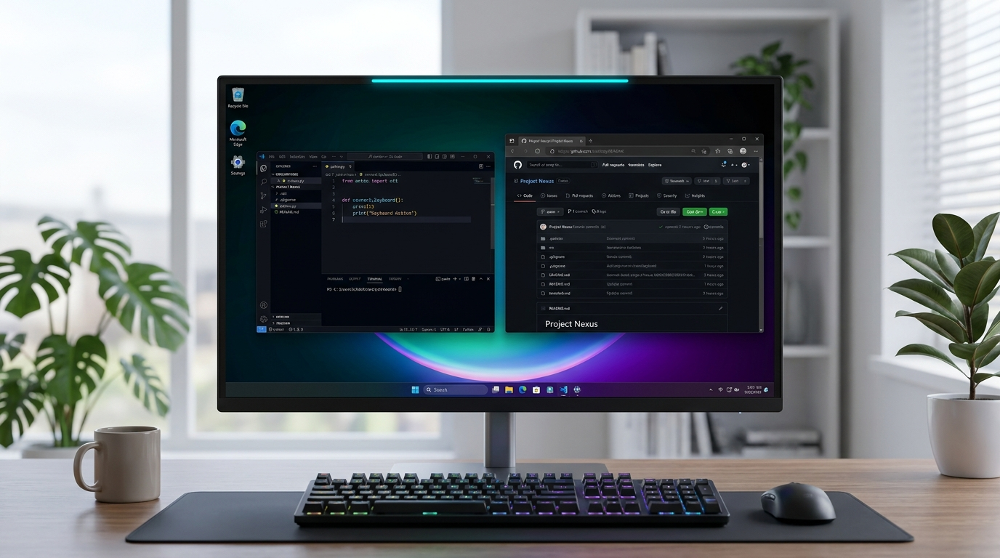
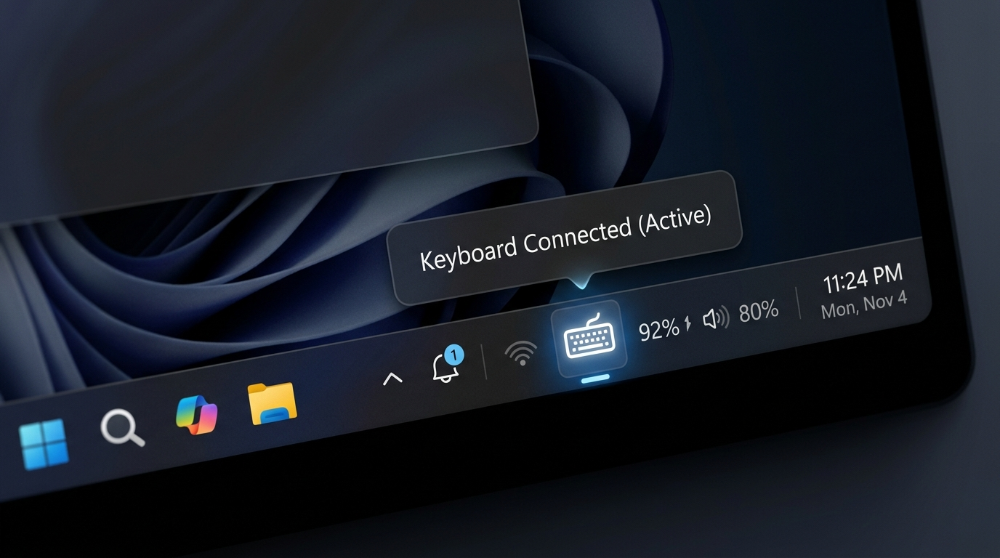
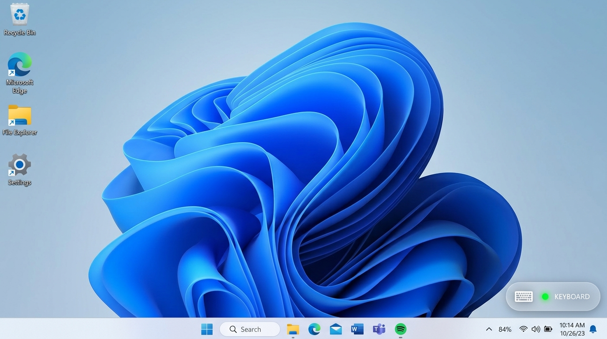

# 键盘连接状态指示标记 - 原型设计方案

针对双电脑通过 USB Hub / KVM 切换键盘的场景，为解决“盲打时不知道键盘当前在控制哪台电脑”的痛点，设计了以下三套高可行性、不打扰办公的视觉原型方案。

---

## 方案 A（首推）：屏幕顶端 2px 极细发光指示条 (Top Edge Glow Line)

> **设计精髓**：利用人类视场边缘的“余光敏感性”。人在注视屏幕中央（代码、文档、浏览器）时，视线上边缘的微弱光条能即时传递状态，无需任何眼球转动。

### 视觉与技术规格
- **呈现形态**：紧贴主显示器最上方边缘（`Y = 0`），高度 2 像素。
- **色彩与质感**：
  - **连接状态**：莫兰迪青蓝 / 极光青（`#00D2BA` 或 `#00A3FF`），透明度 60%~75%，带极微弱的 1px 阴影晕染。
  - **断开状态**：完全透明（0% Opacity）瞬间消失。
- **办公防打扰策略**：
  - **零有效区域遮挡**：无论是浏览器标签页上方、IDE 标题栏，最顶上 2px 都不是可交互文本区。
  - **完全鼠标穿透 (`WS_EX_TRANSPARENT`)**：鼠标点击或拖拽窗口标题栏完全穿透，没有任何阻碍。

---

## 方案 B（经典原生）：任务栏系统托盘动态图标 (System Tray Icon)

> **设计精髓**：完全遵循 Windows 原生 UI 规范，桌面画面 100% 保持纯净，适合对屏幕浮窗有强迫症的用户。

### 视觉与技术规格
- **呈现形态**：驻留在右下角任务栏通知区域（时钟、音量图标旁）。
- **状态表达**：
  - **连接状态**：高亮白色/浅蓝色键盘图标，下方带呼吸小蓝点；鼠标悬停提示 `已连接: 罗技机械键盘 (本机控制中)`。
  - **断开状态**：图标变为暗灰色轮廓或带斜杠 ⃠；也可配置为断开时直接隐藏图标。
- **办公防打扰策略**：
  - **零侵入感**：不占据任何主屏画面空间。
  - **局限注意**：需要眼球移到右下角主动查看，余光感知较弱。

---

## 方案 C（微型悬浮标）：右下角半透明微型胶囊浮标 (Micro Floating Badge)

> **设计精髓**：在屏幕右下角（时钟上方或屏幕边缘）提供一个极低对比度、半透明毛玻璃质感的微型状态胶囊。

### 视觉与技术规格
- **呈现形态**：约 24×80 像素的微型药丸形状胶囊，包含 mini 键盘线框图标 + 状态绿点。
- **色彩与质感**：
  - 采用 Windows 11 Acrylic（亚克力/毛玻璃）半透明材质，背景透明度仅 30%~40%，与桌面壁纸或底层窗口融为一体。
- **办公防打扰策略**：
  - **鼠标避让 / 穿透**：开启 `WS_EX_TRANSPARENT` 点击穿透；当光标移动至胶囊周围 60px 内时，自动淡出至 10% 透明度，彻底避免遮挡任何右下角按钮。

---

## 📊 三套方案横向对比总结

| 评估维度 | 方案 A：顶部极细光条 | 方案 B：任务栏托盘图标 | 方案 C：右下角胶囊微标 |
| :--- | :--- | :--- | :--- |
| **余光秒懂程度** | ⭐⭐⭐⭐⭐（最佳，完全不用转头找） | ⭐⭐（需刻意低头看右下角） | ⭐⭐⭐⭐（位置固定，易识别） |
| **画面整洁度** | ⭐⭐⭐⭐（仅占顶部 2px） | ⭐⭐⭐⭐⭐（完全原生隐藏） | ⭐⭐⭐（桌面多一个浮动小元素） |
| **遮挡与误触风险**| **0%**（顶部非可点区域+鼠标穿透）| **0%**（原生系统托盘） | **0%**（配合淡出避让） |
| **多显示器适配** | 支持只在主屏或全屏边缘显示 | 仅跟随主任务栏 | 支持自由拖动固定位置 |
| **推荐指数** | **首选推荐** | **次选（极简偏好）** | **备选（小组件偏好）** |
